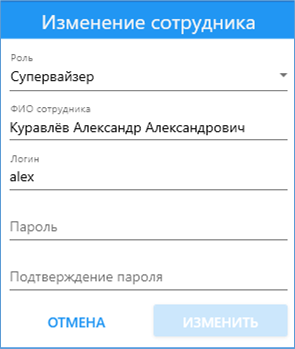
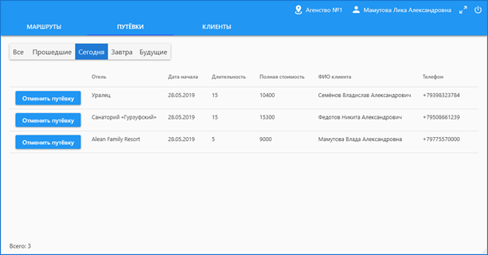
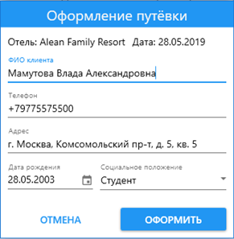
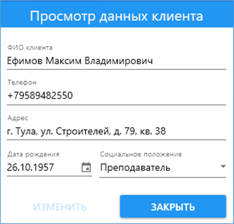

# TravelPortal
Программа "TravelPortal" была разработана как курсовой проект и **представляет собой систему для работы с базой данных** туристического портала России.

Программное обеспечение туристического портала предоставляет возможность работать **пользователям трёх ролей**:
- администратор комплекса;
- супервайзер;
- сотрудник туристического агентства. 

**Администратор комплекса** может выполнять любые операции со справочниками, добавлять и удалять сотрудников туристического портала. **Супервайзеру** (аналитику) доступен просмотр рейтинга агентств по различным критериям, диаграмм, статистики посещаемости отелей. **Сотрудник агентства** может просматривать основные таблицы «Маршруты» и «Путёвки», а также составную таблицу «Клиенты», причём только те записи, которые были созданы агентством, в котором он работает. Также сотрудник может осуществлять поиск и фильтрацию информации в таблицах, создавать маршрут, отменять его и редактировать, оформлять и отменять будущие путёвки, изменять данные о клиенте агентства.

Интерфейс программы подстраивается под роль авторизированного пользователя.

